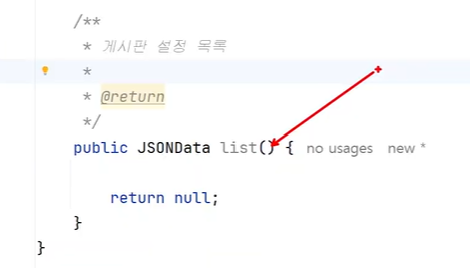

처음엔 관리자쪽!
보드 패키지를 만들고 보드어드민컨트롤러를 생성
보드 컨트롤러 생성
그리고 댓글도 필요하니까 코멘트 컨트롤러도 생성!
세개다 기본설정 의존성주입, 경로, 레스트컨트롤러 만 추가해줌

그후
어떤방식으로 할지 정하고 경로정한걸 넣어서 우선 만든게 없으니 반환값은 null을 넣어서 틀만 만들어줌
// 반환값이 있으면 JSON 데이터, 없으면 void로 해주면 됨.

// 보드어드민컨트롤러
@PostMapping("/config")
public JSONData save() {
        return null;
    }

이런식으로!

어드민에서 관리자쪽을 다했으니 이제 일반 사용자쪽을 생성!
보드 컨트롤러 == 일반사용자쪽

1. 게시판 설정쪽
설정 등록 수정 처리
등록하거나 수정후에 바로 보고싶어하고 후속처리해줄수있게 반환 / 수정처리시 api에는 변경되어있겠지만 프론트쪽에서도 반영을 할려면 값을 보내줘야 반영이 가능하므로 등록수정시에 반환값으로 바로 게시판 설정을 보여줄수 있게 반환값이 있는 형태로 만들었음 // JSONData

2. 게시판 목록
GET방식으로 가져옴

3. 
커맨드객체에 대한건 이부분에 정의가 필요함