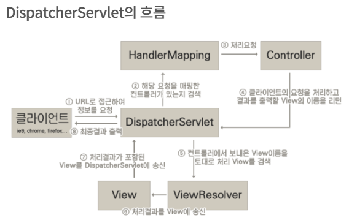
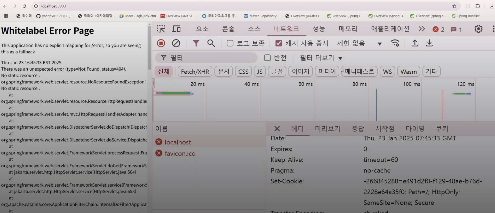

인터셉터는 사용자의 요청을 가로채는 역할을 함.

사용자의 요청이 컨트롤러에 가기 전에 가로채고 서버의 응답이 사용자에게 가기 전에 가로챔
-> DispatcherServlet이 컨트롤러를 요청하기 전/후에
HttpRequest, HttpResponse 객체를 가로채어 가공함.

예시)
로그인기능 구현시
로그인 한 사람만 글도 작성하고 볼 수 있는 페이지가 있다고 가정시,
페이지 컨트롤러, 글작성 컨트롤러에서도 로그인 여부를 확인하는 로직이 필요한데 이때 인터셉터를 이용해서 따로따로 안만들고 로그인로직을 공통으로 처리할 수 있음

---

쿠키를 설정하는건 리액트에서 할거라 다른플랫폼이기 때문에 직접 헤더에 쿠키를 설정해줬음
Path=/; 는 전체경로/, Secure는 Https일때만 쿠키공유가 가능하기때문에 추가했음
HttpOnly : 서버쪽에서만 조회가 가능하게 설정
쿠키가 아에 없는경우도 있기 때문에 null이 아닐때 조건을 추가함

-> Set-Cookie를 추가하면 네트워크 헤더에서 추가된걸 확인 가능함

---
